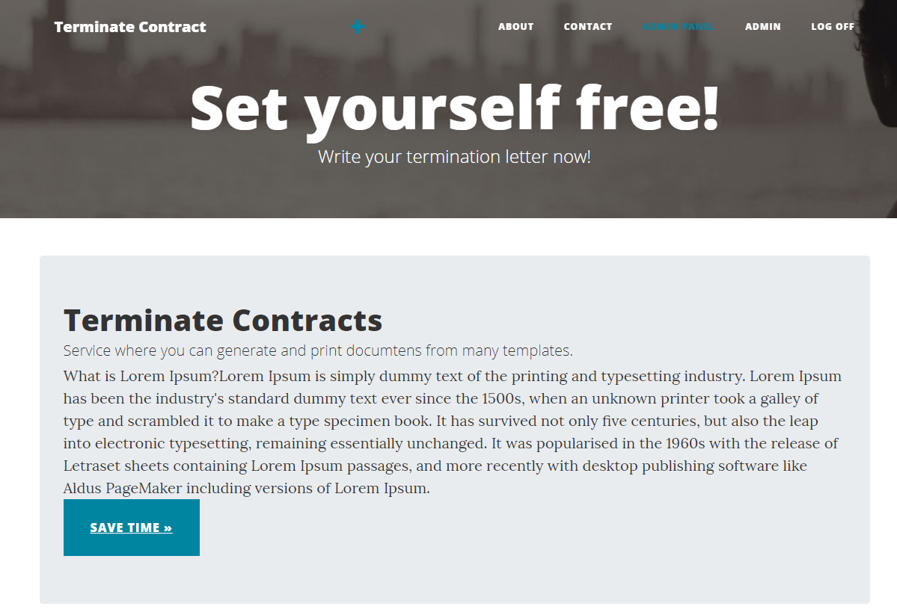
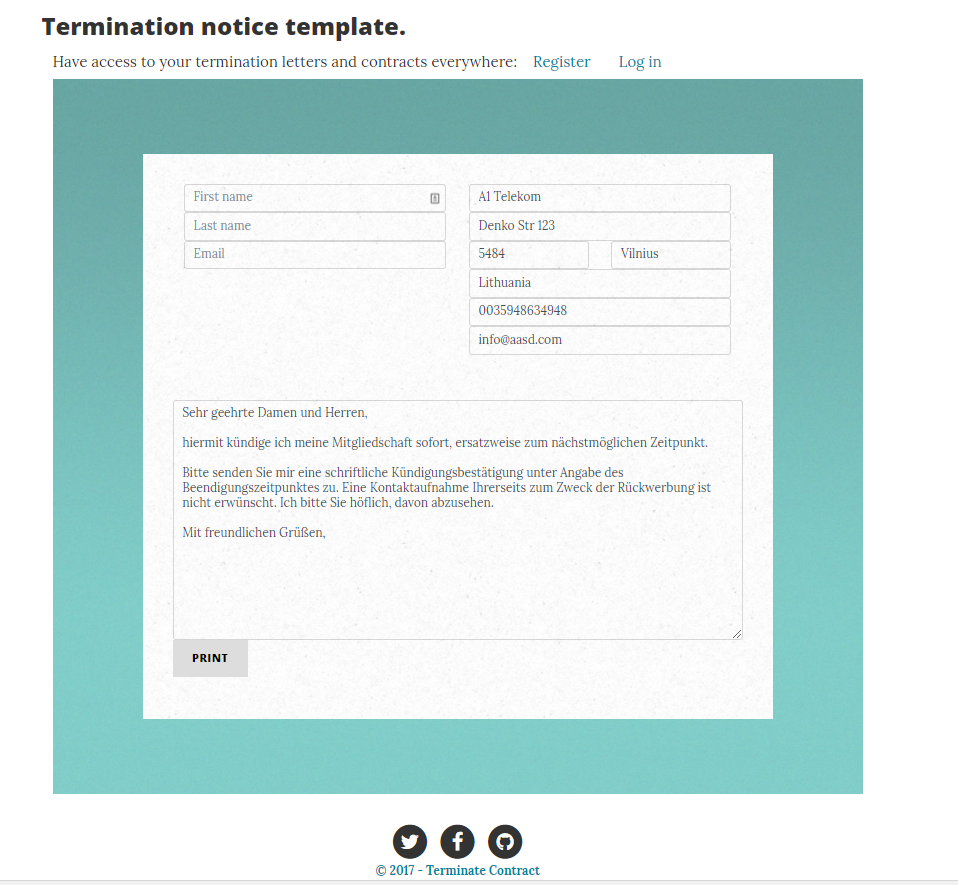
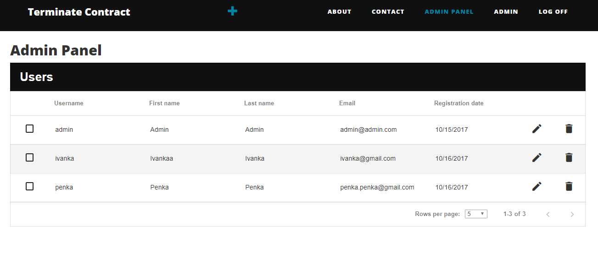

### Terminate Contract

*Terminate contract is a project created as part of the course assignment for the course [ASP.NET MVC](http://telerikacademy.com/Courses/Courses/Details/444) at [Telerik Academy](http://telerikacademy.com/) 2016-2017 by Milena Sapunova.*

It is a online service that provides different document templates for users. They can fill and edit the template to fit their needs. After the document is ready the user is provided with two options: to save it in their user porifile and access it from anywhere or to print it right away from their browser. In addition, one can register a contract and its notice period. The service can then remind the user to terminate the contract before it is going to be renewed.

The application is work in progress.

**Todo list:**
* Profile page to be editable
* Form for adding contracts
* Remind users to terminate contracts
* Show list of companies so users can choose

**Main Page**

**Termination Contract Form**

**Admin Panel**

